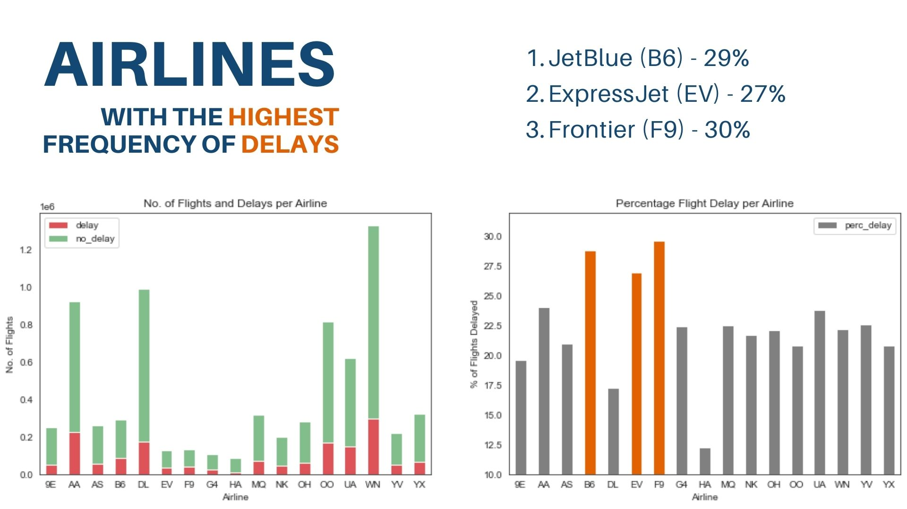
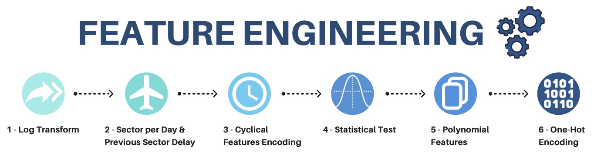
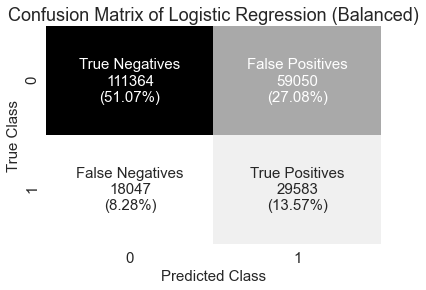
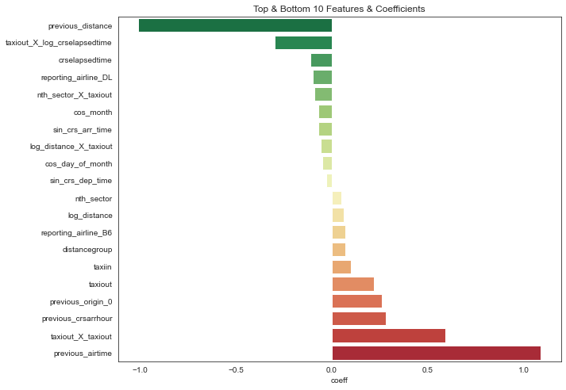

# Flight Delay Prediction

*Capstone Project* | *Looi Jia Wen*

## Background

Flight delay represents a common problem in the air traffic and aviation industry. Flight punctuality is one the most important factor affecting service quality perceptions and airline reliability, as poor punctuality and communication can quickly ruin a passenger’s flight experience. To retain customers loyalty in the long term, airlines must constantly improve their flight punctuality to stay competitive.|

## Problem Statement

- When a delay is anticipated, airlines can then cushion the impact by implementing appropriate contingency plans and mitigating inconveniences experienced by passengers.
- With better flight delay information, passengers can make better decisions when planning for trips or booking flights.

## Dataset

- Collected by the Bureau of Transportation Statistics under the United States Department of Transportation
- Consist of an extensive set of historical flight data which covers more than 20 years
- We will be using 2019 fight data alhough there are more recent data available, because flight patterns in 2020-2022 are more unusual because of COVID. 2019 was still pre-COVID and it was also the year when air travel was at its peak.

## Methodology 

### 1. Data Pre-processing & Exploratory Data Analysis

### 2. Feature Engineering

### 3. Model Training & Tuning
### 4. Model Evaluation

| Model                                   | Train  | Test   | Recall | F1 Score |
|-----------------------------------------|--------|--------|--------|----------|
| Logistic Regression (Balanced Weighted) | 0.6467 | 0.6464 | 0.6211 | 0.4342   |
| Logistic Regression (Manually Weighted) | 0.7946 | 0.7947 | 0.0670 | 0.1254   |
| Random Forest                           | 0.9859 | 0.8011 | 0.1748 | 0.2195   |
| AdaBoost                                | 0.7998 | 0.7990 | 0.1381 | 0.2195   |

## Recommendations

All airports and airlines face delays, and on many occasions, delays are inevitable. But if we are able to anticipate a delay, airlines will have more time to prepare contingency plans to cushion the impact of flight delays better. So what can airlines do to prepare for a delay?
    
**Maintaining Customer Satisfaction (Unavoidable Delays)**    

- Notifying passengers of possible delays in advance
- Deploy extra staff for that flight in view of longer flight hours 
- Preparing adequate food, water and amenity kits for customers
- Provide re-booking services or other flight alternatives in the event of a severe delay

**Better Flight Planning to Avoid Delays**

- Especially for low-cost carriers, most of their flights are short-haul. The core aspect of the business model depends heavily on quick aircraft turnaround. Hence, one delayed arrival can have a domino effect on the subsequent flights for that aircraft.
- With delay information easily available, airlines can plan better flight schedules or allocate more buffer time for aircraft turnaround. 
- Airlines may also assure passengers by offering well-planned flight connections or help holidaymakers make better decisions by providing suggestions, such as choosing a destinations with point-to-point flights to reduce the likelihood of a delay.
